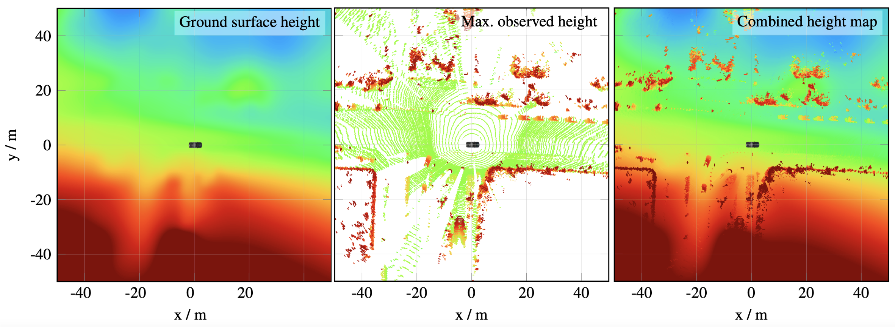

# Fast and Robust Ground Surface Estimation from LIDAR Measurements using Uniform B-Splines

This repository contains the source code, examples and further information regarding our [approach](http://arxiv.org/abs/2203.01180) of estimating a ground surface from LIDAR Measurements using Uniform B-Splines.

## Publication

**Titel**: Fast and Robust Ground Surface Estimation from LIDAR Measurements using Uniform B-Splines

**Authors**: Sascha Wirges and Kevin Rösch and Frank Bieder and Christoph Stiller

**Abstract**: We propose a fast and robust method to estimate the ground surface from LIDAR measurements on an automated vehicle. The ground surface is modeled as a UBS which is robust towards varying measurement densities and with a single parameter controlling the smoothness prior. We model the estimation process as a robust LS optimization problem which can be reformulated as a linear problem and thus solved efficiently. Using the SemanticKITTI data set, we conduct a quantitative evaluation by classifying the point-wise semantic annotations into ground and non-ground points. Finally, we validate the approach on our research vehicle in real-world scenarios.

**Citation**: If you use this source code, please cite its [paper](http://arxiv.org/abs/2203.01180)

```
@inproceedings{wirges2021groundsurfacce,
    title={Fast and Robust Ground Surface Estimation from LIDAR Measurements using Uniform B-Splines},   
    author={Sascha Wirges and Kevin Rösch and Frank Bieder and Christoph Stiller},
    year={2021},
    booktitle = {2021 IEEE 24th International Conference on Information Fusion (FUSION)},
}
```
## Usage

The repository is organized in the following format:

```bash
pointcloud_surface/
          ├── include/                                              # header files
          ├── res/
                ├── assets/                                         # images for the github repo
                └── parameters.yaml                                 # parameter file
          ├── src/                                                  # source code including all cpp files
          └── test/                                                 # unit test for the ground surface estimation

```

### Dependencies

The dependencies can be reviewed in the file [package.xml](package.xml) and include catkin, mrt_cmake_modules, gtest, libgoogle-glog-dev, libceres-dev, libpcl-all-dev, uniform_bspline_ceres, uniform_bspline_eigen, util_ceres, util_eigen and util_yaml


### Run
tbd


## Results on our research vehicle

We implemented and validated our approach on our research vehicle [BerthaOne](https://ieeexplore.ieee.org/document/8055618)

---
### Example of full 360° scans of all LIDARs on the experimental vehicle and estimated ground surface.
:


---

### Example of our combined height map fusing the ground surface height and max observed reflexion height in each grid cell:


---


